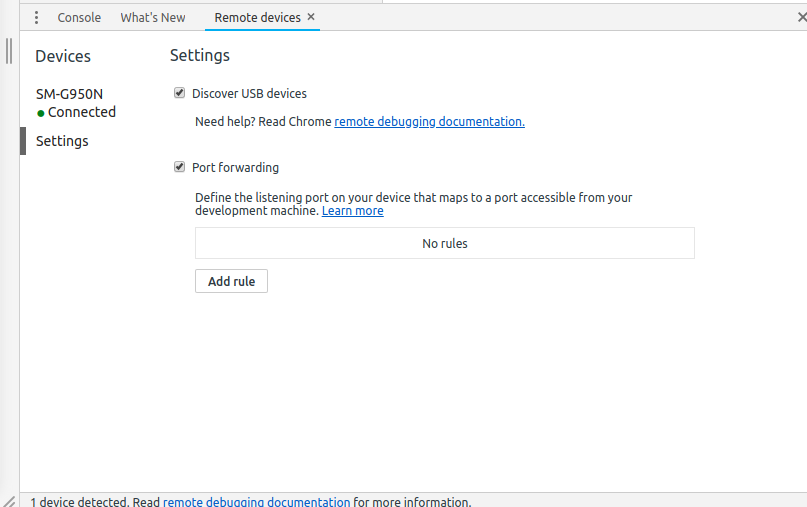
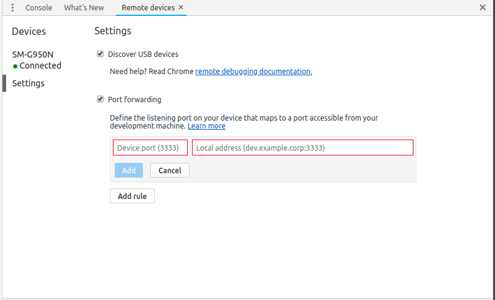
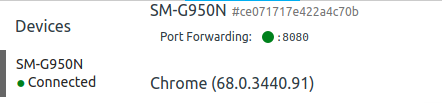

# 로컬 서버 액세스

대부분의 앱은 서버와 통신을 하는 기능이 있죠.  
그래서 서버와 직접 통신 기능을 테스트해야 하는 경우가 생깁니다.  
저같은 경우는 개인 서버가 따로 없습니다.  
그래서 서버, 클라이언트(안드로이드) 개발을 모두 로컬에서 합니다.    

그런데 이게 클라이언트 개발시에는 불편한 점이 뭐나면,  
테스트로 로컬에서 서버를 돌리면 클라이언트 단에 항상 변할 수도 있는 서버주소를    
제공해야 한다는 겁니다.
(예를 들면 192.~ 같은 내부주소)

그런데 최근 보다 편한 방법을 알게 됐습니다.
   
이 방법을 이용하면 네트워크 구성에 의존하지 않고도 안드로이드 기기와 개발용 컴퓨터 사이에
트래픽을 이동시킬 수 있어서 저같은 경우네는 도움이 됐습니다.

기본적으로는 [구글의 크롬 개발자 도구 안내](https://developers.google.com/web/tools/chrome-devtools/remote-debugging/local-server?hl=ko)에도 올라가 있는 방법이에요.     

## How-to
1. Android 기기의 원격 디버깅 활성화     
    기기의 설정 -> 개발자 옵션 -> usb 디버깅 활성화

2. 크롬 개발자도구(ctrl + shift + i)의 Remote devices의 Settings에서 Port Forawding 활성화
    
3. Add rule을 클릭
     
	왼쪽에 Andrid기기에서 접속할 localhost 포트 번호를,    
	오른쪽에 local address에 로컬 웹서버에서 실행 중인 사이트의 IP주소와 포트번호를 입력합니다.
   	저는 안드로이드 기기에서 8080포트를 통해 8080포트의 로컬 API서버에 접속하려 하므로    
	왼쪽에는 8080 오른쪽에는 locahlost:8080을 적었습니다.   
   	
	그 다음 크롬의 개발자 도구에서 본인 기기의 탭에 들어가시면     
 	   
   	포트포워딩이 정상 작동 중임을 알 수 있습니다.

   설정이 완료된 후에는 일반적인 통신에서도 설정해둔 포트로 로컬 서버 엑세스가 가능합니다.  
   단, 항상 로컬에서 크롬 개발자 도구가 실행중이어야 하고, 안드로이드 기기에서도 크롬이 실행중이어야    합니다.  
   작동이 되지 않는 경우에는 크롬 개발자 도구에서 No browser detected라고 뜨는지 확인해주세요.   
   해당 메세지는 기기에서 크롬을 실행시키지 않아서 뜨는 경우입니다.  
   안드로이드 기기에서 크롬을 실행하시면 정상적으로 포트 포트워딩이 작동할 것입니다.    
    
   미립자 팁이지만 유용하게 사용하셨으면 좋겠네요. 감사합니다

