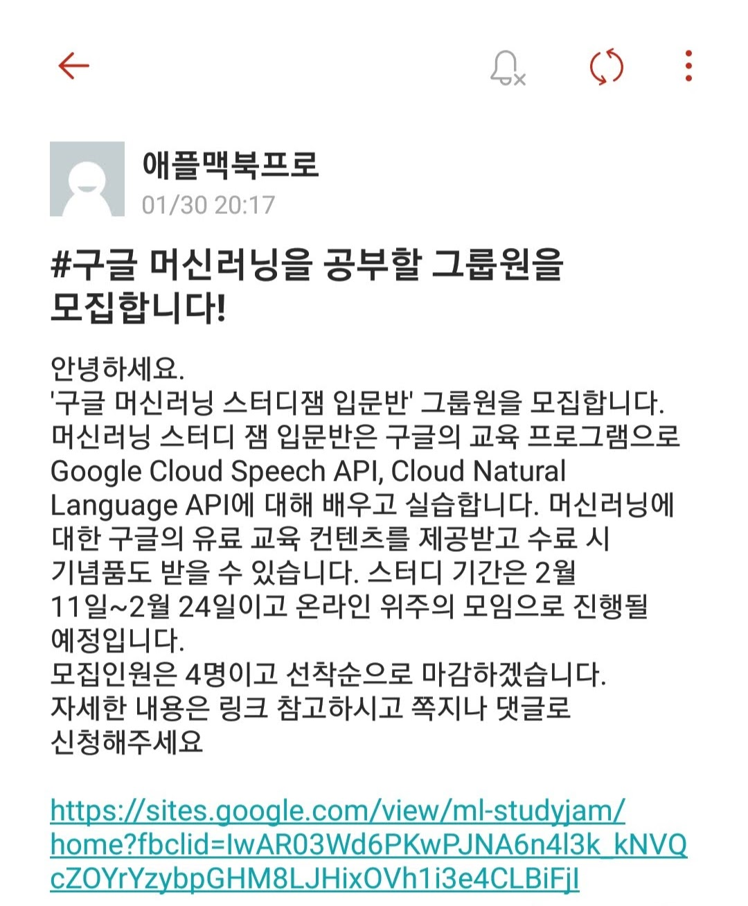
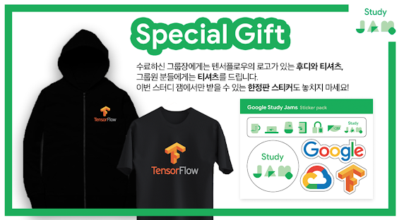

저번주 금요일인 8일에 구글에서 진행하는 스터디인 머신러닝 스터디잼을 신청했습니다.  
오늘부터 1일차로 강의를 듣고 왔습니다.  
짧게나마 구글에서 진행하는 스터디잼 관련 정보 및 후기를 공유하고자 합니다.  

## 목차
[1. 머신러닝 스터디잼 신청 계기](#나는-어떻게-스터디잼을-신청하게-되었는가)

[2. 구글 머신러닝 스터디잼 소개](#구글-머신러닝-스터디잼-소개)  
      &nbsp;&nbsp;&nbsp;&nbsp;&nbsp;&nbsp;&nbsp;&nbsp;
      [* 어떻게 진행되는가?](#어떻게-진행되는가?)  
      &nbsp;&nbsp;&nbsp;&nbsp;&nbsp;&nbsp;&nbsp;&nbsp;
      [* 보상](#보상)  

[3.  1일차 후기](#1일차-후기)

## 나는 어떻게 스터디잼을 신청하게 되었는가
   군입대를 앞두고  
   내가 군입대를 한다는 절망과  
   아직 몇 달 남았다는 잉여로움과 함께  
   하루하루가 지나가던 도중  
   학교 커뮤니티에서 재밌는 모집글을 발견했습니다.  

   

   어차피 군 입대 전에 할 것도 없겠다.. 해서 신청해버렸습니다.  
   솔직히 머신러닝을 배우고 싶기 보다는 스터디잼 보상에 더 끌렸던것 같습니다. +ㅅ+   
   ~~머신러닝 배워도 군대 갔다오면 까먹지 않을까...~~ 

## 구글 머신러닝 스터디잼 소개
   구글에서 진행하는 스터디잼은 현재 두 개입니다.  
   하나는 제가 이번에 참가한 [머신러닝 스터디잼](https://sites.google.com/view/ml-studyjam/)이고,  
   나머지 하나는 [클라우드 스터디잼](https://sites.google.com/view/cloud-studyjam)입니다.  

   관계자 분께서 말씀해주시길,  
   홀수달에는 클라우드, 짝수달에는 머신러닝 주제의 스터디 잼이 개최된다고 하네요.

   입문 - 중급 - 심화 과정순으로 진행된다고 하며,  

   두 프로그램의 참가 모집 공지는 [구글 개발자 생태계팀 페이스북](https://www.facebook.com/gdgkorea/)에서 확인하실 수 있습니다.

   기본적으로 팀당으로 신청하며, 
   팀은 그룹장과 그룹원으루 구성됩니다.  
   최소 인원 또한 존재하구요.  

## 어떻게 진행되는가?
   기본적으로 Qwiklab을 통해 직접 실습을 하는 방식으로 진행됩니다.
   신청을 하면 구글에서 퀵랩쿠폰을 제공하고,  
   퀵랩쿠폰 등록 후 교육 콘텐츠를 수강할 수 있습니다.  

   이후, 수료 미션으로 제공되는 특정  수료하면 보상을 받을 수 있게 됩니다.

   

## 보상
     

   그룹원들에게 티셔츠, 스티커를 재공하며.  
   그룹장에게는 후디를 추가로 제공합니다.  

   ~~사이즈 관련해서 웃픈 에피소드도 있었지만  
   이건 오프더레코드로...~~

   물!론! 제일 좋은 건 무상으로 제공해주는 교육 자료겠죠~

## 1일차 후기  

## 아쉬운 점 
  먼저 말씀드려야 할 게 있다면 **프로그램에서 어떤 걸 공부하는가?** 에 대해서 입니다.  

  이 부분에 관해서 조금 헷갈릴 수가 있겠더라구요.  
  물론, 사이트에 어떤 부분에 관해서 교육을 받는 지가 표시되어있고,  
  저 또한 그것을 확인하고 신청했습니다.  
  그런데, 스터디잼 진행 중에 예상한 내용과 달랐다는 분들이 여럿 계셨습니다.  

  진행되는 프로그램의 이름이 **머신러닝** 스터디잼이지만,  
  **제공되는 교육 콘텐츠**는 **머신러닝 그 자체** 에 대해서 배우는 것이 아닙니다.  
  즉, 머신러닝이 무엇인지, 그 원리가 무엇인지와는 거리가 조금 멉니다.  

  그 보다는 머신러닝과 관련된 **구글 클라우드 서비스를 어떻게 활용하는가?** 가 제공되는 교육 콘텐츠를 잘 표현하는 것 같습니다.  

  즉, 머신러닝의 원리와 같은 이론적인 부분에 대해서는 Coursera의 강의나  
  구글이 제공하는 [머신러닝 단기집중과정](https://developers.google.com/machine-learning/crash-course/?hl=ko)를 참고하시는 게 좋습니다.  
  개인적으로는 신청한 그룹원들과 제공되는 교육 자료와는 별개로   
  함께 공부하는 것도 좋다고 생각합니다.
  

  이전 기수에서는 Coursera 등을 활용하여 원리적인 부분에 대한 교육이 이루어졌다고 들었으나, 관련 링크나 자료를 찾지 못했습니다.

  아마 중급, 심화 단계에서 다루지 않을까 싶습니다만  
  자세한 사항은 이후 과정을 보고 본문 내용을 업데이트 해야 될 것 같네요.

## 글을 마치며..
  그럼에도 불구하고, 개인적으로는 구글 클라우드 플랫폼(GCP)을  실습으로 다뤄볼 수 있어서 좋았습니다.  
  _~~머신러닝보단 GCP에 대해 더 많이 배운건 유머~~_ 
  
  이전에는 AWS에만 관심이 있다보니,  
  구글 클라우드 쪽은 다뤄볼 일이 없었거든요.  

  모쪼록, 이런 기회가 생겨서 좋네요.  
  앞으로도 이런 교육 프로그램이 많이 생겨서 국내 개발자 생태계가  
  더욱더 활성화 되면 좋겠습니다.

  
 

  

  
  
  
 

   

