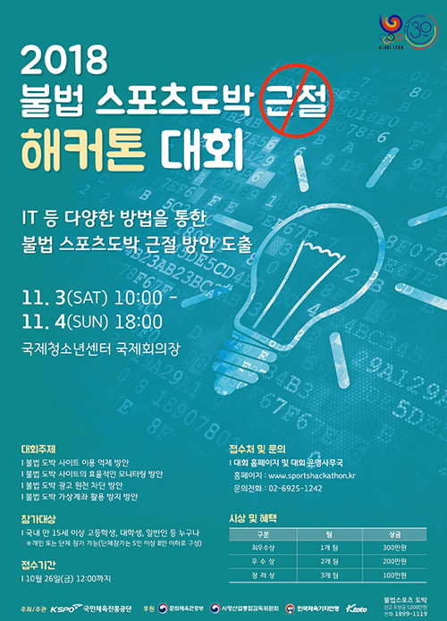
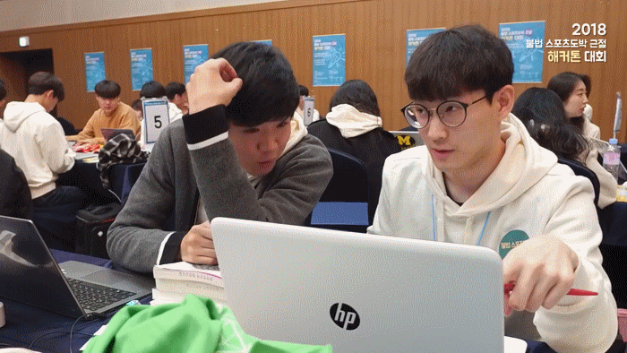
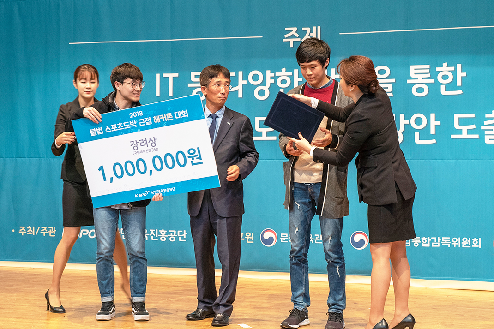

# Overview
* * * 

   

    

   필자는 IT 관련 뉴스들을 자주 챙겨보는 편이다.   
   그래서 심심치 않게 해커톤 개최 또는 수상 기사를 접한다.  
   기사에 나와있던 수상자들의 사진을 보면 대단하다는 생각이 든다.  

   참신한 아이디어를 생각해내고,  
   단기간 내에 결과물을 만들어 낸다는 것이 얼마나 어려운지 짐작도 가지 않아서였다.  
   

# 목차
* * *
   [- 기존의 불법 도박 사이트 모니터링 방식 ](#기존-불법-도박-사이트-모니터링-방식)  
   [- 아이디어](#아이디어)  
   [- 개발](#개발)  
      &nbsp;&nbsp;&nbsp;&nbsp;[* 딱 맞는 논문을 찾다](#딱-맞는-논문을-찾다)  
   [- 수상](#수상)

# 기존 불법 도박 사이트 모니터링 방식
* * * 
  
   우리팀은 4개의 주제중  
  **불법 도박 사이트의 효율적인 모니터링 방안**  
  이라는 주제로 참가했다.  

  그래서 기존의 모니터링 방식은 어떤지 알아보았는데 생각보다 수동적이었다.  

  모니터링단과 같의 외부 협력을 통해 사람이 직접 찾거나,  
  [불법사행산업감시신고센터](https://singo.ngcc.go.kr/notify/intro.do)를 통해 들어온 신고를   
  담당자가 직접 모니터링 하는 방식이었다.  

  두 방식 모두 사람이 하다 보니,  
  당연히 그 효율은 낮을 수밖에 없어 보였다.  

  더욱이 이렇게 모니터링을 통해 차단된 사이트들도,  
  단속을 피하기 위해 도메인만 바꾸면 재접속이 가능했기에 어려움이 많아보였다.  

# 아이디어
* * *
  우리는 도박 사이트들도 근본적으로 이용객을 모으기 위해서  
  홍보를 해야 한다는 점에 주목했다.  

  홍보를 한다는 것은 노출로 이어지고,  
  노출은 곧 검색엔진에 랭크되는 결과로 이어진다.  

  실제로 구글에 불법 도박과 연관된 키워드를 입력해본 결과,  
  상위권에 랭크되는 다수의 사이트들을 볼 수 있었다.  

  그 결과 크게 두 가지의 사이트 유형으로 구분할 수 있었다.  

  * 폐쇄적인 불법 도박 사이트 
  * 불법 도박 사이트를 홍보해주는 사이트  
   
    
  검색엔진에 랭크되어 있는 이러한 사이트들을 자동으로 탐지하는 소프트웨어를 만들어보기로 했다. 

# 개발
* * *
  해당 사이트들을 어떻게 탐지할까?  
  라는 질문에 다양한 후보들을 생각했다.  
  그 중에는 딥러닝도 있었다.  
  그러나 모두 무박 2일이라는 짧은 시간에는 구현이 어려워 보였다.  

  무엇보다 딥러닝 기술자가 우리팀엔 없었고..  

  
  ~~고민이 많았던 우리들의 모습~~

  그렇게 아이디어를 생각하던 도중, 정말 우리에게 딱 맞는 논문을 찾을 수 있었다.   

## 딱 맞는 논문을 찾다
* * *
  우리의 상황에 적용할 만한 기술이 없을까 하며 논문을 찾고 있을 때,  
  한 논문이 내 시선을 붙잡았다.

  *[HTML 태그 순서를 이용한 불법 사이트 탐지 자동화 기술](https://ccs.korea.ac.kr/pds/KIISE16.pdf)*

  단숨에 "이거다!" 라는 느낌이 왔다.  
  바로 인쇄해서 읽어보았다.  
  해당 논문은 불법 사이트 탐지에 다음과 같은 방법을 제시했다.  
  의심되는 사이트와 불법 사이트간의 유사도를 계산하는데,     
  사이트의 HTML 태그 순서를 유사도 계산 파라미터로 이용한다는 것이다.  

  논문에 나와있는 정확도를 봤을 때 이 정도면 괜찮다. 라고 생각했다.  
  무엇보다 짧은 시간에도 충분히 구현이 가능해 보였다. 

  팀원인 민영님도 긍정적인 반응을 보이셨기에,  
  바로 해당 기능을 구현하기 시작했다.  

  민영님은 외부 검색엔진과 연동부분을 구현하셨고,  
  나는 해당 검색엔진에서 넘겨주는 의심사이트들을 기존에 등록된  
  불법 사이트들과 유사도를 비교해주는 알고리즘을 구현했다.  

# 수상 
* * *
  첫 해커톤 참가였고 우리보다 뛰어난 팀들도 많았기에  
  그닥 수상기대는 안했다.  

  그런데 우리팀 이름이 불리더라.  
  
  
   ``해당 사진은 행사 주최측 홈페이지에서 가져왔습니다``

   다른 팀은 인원이 5~6 명 정도 되었는데,  
   우리는 행사 끝까지 인원 충원이 안되서 2명이서 진행앴었다.  
   덕분에 한 사람당 작업량이 많아서 피곤했지만, 즐거운 경험이었다.  

   요즈음도 재밌는 해커톤이 없나 한 번씩 찾아보고 있다.  
   수상팀 호명시에 불렸던 우리 팀의 이름.  
   그 때 느꼈던 짜릿함은 앞으로도 잊지 못할 것 같다.  

  
